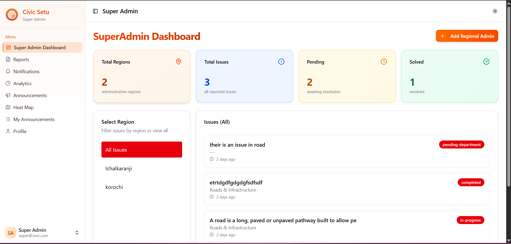
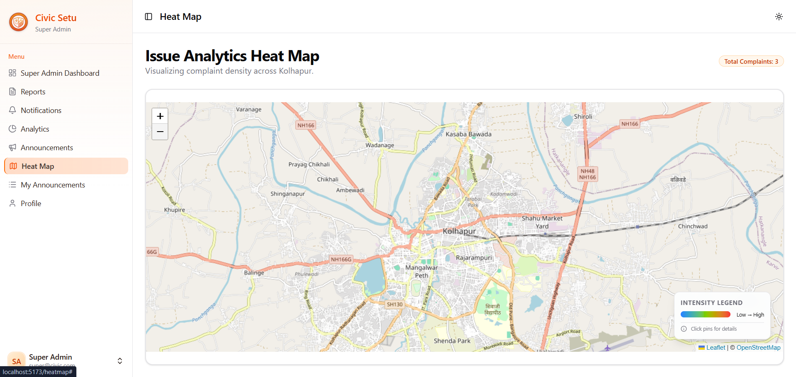
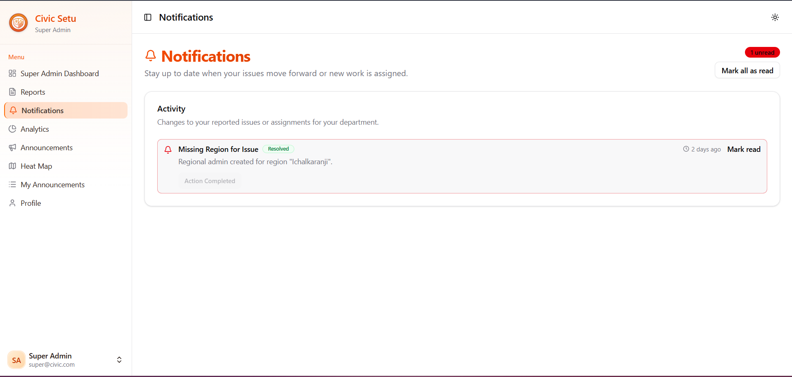

# Civic Issue Reporter

A comprehensive web application designed to empower citizens to report civic issues and enable authorities to manage and resolve them efficiently. This platform bridges the gap between the public and government officials, fostering a cleaner and safer community.

## 🚀 Purpose / Problem Solved

Civic issues like potholes, garbage dumps, and broken streetlights often go unnoticed due to the lack of a streamlined reporting mechanism. **Civic Issue Reporter** solves this by providing:

-   **Citizens:** A simple platform to report issues with geo-location and AI-enhanced descriptions.
-   **Authorities:** A powerful dashboard to view, track, and analyze issues using heatmaps and AI insights.

## 🛠️ Tech Stack

### Frontend
-   **Core:** React 19, Vite
-   **Styling:** Tailwind CSS, Framer Motion, Lucide React
-   **Components:** Radix UI, Shadcn UI
-   **Maps & Visuals:** Leaflet, React Leaflet, Heatmap.js, Lottie Web
-   **Real-time:** Socket.io Client

### Backend
-   **Runtime:** Node.js, Express.js
-   **Database:** MongoDB (Mongoose)
-   **AI Integration:** Google Gemini AI (Generative AI)
-   **Authentication:** JWT, BCryptJS
-   **Image Storage:** Cloudinary
-   **Notifications:** SendGrid / Nodemailer

## ✨ Features

-   **📸 AI-Powered Reporting:** Upload a photo, and Gemini AI automatically generates a description of the issue.
-   **📍 Geo-Tagging:** Pinpoint exact locations of issues using interactive maps.
-   **🔥 Heatmaps:** Visual representation of issue density to identify problem hotspots.
-   **🔔 Real-time Notifications:** Instant alerts for status updates and new announcements.
-   **📊 Admin Dashboard:** Comprehensive analytics and management tools for department and region administrators.
-   **💬 Community Engagement:** Users can like and comment on reported issues.

## 📸 Screenshots

| Admin Dashboard | Analysis |
|:---:|:---:|
|  |  |

| Heatmap Visualization | Notifications |
|:---:|:---:|
|  |  |

## 📦 Installation Steps

### Prerequisites
-   Node.js (v18+ recommended)
-   MongoDB (Local or Atlas)
-   Cloudinary Account
-   Google Gemini API Key

### 1. Clone the Repository
```bash
git clone https://github.com/yourusername/civic-issue-reporter.git
cd civic-issue-reporter
```

### 2. Backend Setup
Navigate to the backend directory and install dependencies:
```bash
cd backend
npm install
```

Create a `.env` file in the `backend` directory with the following variables:
```env
PORT=5000
MONGODB_URI=your_mongodb_connection_string
JWT_SECRET=your_jwt_secret
GOOGLE_API_KEY=your_gemini_api_key
CLOUDINARY_CLOUD_NAME=your_cloud_name
CLOUDINARY_API_KEY=your_api_key
CLOUDINARY_API_SECRET=your_api_secret
```

Start the backend server:
```bash
npm start
# OR for development
npm run dev
```

### 3. Frontend Setup
Open a new terminal, navigate to the frontend directory, and install dependencies:
```bash
cd frontend
npm install
```

Create a `.env` file in the `frontend` directory:
```env
VITE_API_URL=http://localhost:5000
```

Start the development server:
```bash
npm run dev
```

## 📖 Usage

1.  **Sign Up/Login:** Create an account as a citizen.
2.  **Report an Issue:** Click "Report Issue", upload a photo (AI will analyze it), confirm location, and submit.
3.  **Track Status:** View your reported issues and their current status (Pending, In Progress, Resolved).
4.  **Admin Access:** Log in with admin credentials to view the dashboard, assign tasks, and update issue statuses.

## 📡 API Endpoints

| Method | Endpoint | Description |
| :--- | :--- | :--- |
| **POST** | `/api/auth/register` | Register a new user |
| **POST** | `/api/auth/login` | Authenticate user and get token |
| **GET** | `/api/auth/me` | Get current user details |
| **GET** | `/api/issues` | Get all issues (Public feed) |
| **POST** | `/api/issues` | Submit a new issue |
| **POST** | `/api/issues/analyze-image` | Analyze image using Gemini AI |
| **GET** | `/api/issues/my` | Get issues submitted by current user |

## 📂 Project Structure

```
civic-issue/
├── backend/                # Server-side logic
│   ├── src/
│   │   ├── config/         # Database and third-party configs
│   │   ├── models/         # Mongoose Data Models
│   │   ├── routes/         # API Routes
│   │   ├── services/       # Business logic (AI, etc.)
│   │   └── index.js        # Entry point
│   └── package.json
└── frontend/               # Client-side application
    ├── src/
    │   ├── assets/         # Images and icons
    │   ├── components/     # Reusable UI components
    │   ├── pages/          # Application views
    │   ├── services/       # API integration
    │   └── App.jsx         # Main Component
    └── package.json
```

## 🔮 Future Improvements

-   **📱 Mobile App:** Native mobile application using React Native for better on-the-go reporting.
-   **🌐 Multi-language Support:** Localization for wider accessibility.
-   **📶 Offline Mode:** Allow users to draft reports without internet and sync when online.
-   **🤖 Enhanced AI:** More advanced image analysis and automated categorization.

## 🤝 Contributing

Contributions are welcome! Please follow these steps:
1.  Fork the repository.
2.  Create a new branch (`git checkout -b feature/YourFeature`).
3.  Commit your changes (`git commit -m 'Add some feature'`).
4.  Push to the branch (`git push origin feature/YourFeature`).
5.  Open a Pull Request.

## 📄 License

This project is licensed under the MIT License.

## 👤 Author

**Project Owner**
-   Contact: [Your Email / LinkedIn]
-   GitHub: [Your Profile]
